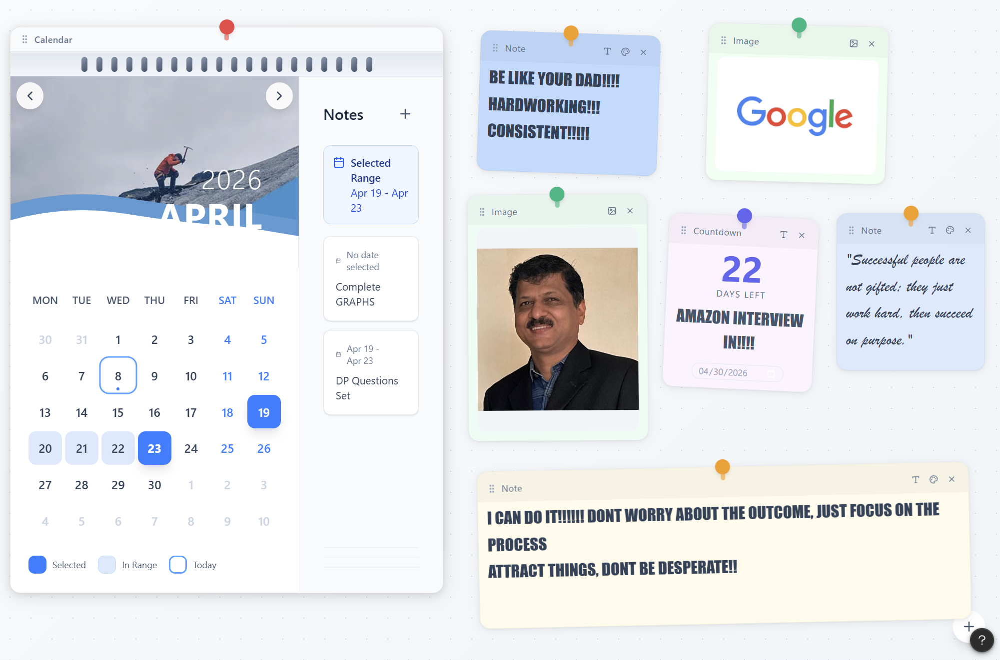

<div align="center">
  

  <h1>🗓️ Interactive Event Calendar & Pinboard</h1>
  
  <p>
    <strong>A stunning, modern, and highly interactive calendar web application.</strong>
  </p>
  
  <p>
    <a href="https://silksync.vercel.app/"><strong>Live Demo</strong></a> · 
    <a href="https://drive.google.com/drive/folders/1fJ8xMYEQqWo2ahAxzHCmm4pB40h0svnY?usp=sharing"><strong>Video Demonstration</strong></a>
  </p>

  <br />
</div>

## ✨ Features

- **Dynamic Range Selection**: Seamlessly select date ranges on the calendar.
- **Interactive Pinboard**: A dynamic workspace for your ideas and tasks.
- **Sticky Notes**: Create, edit, and organize stylized notes.
- **Cloud Persistence**: Integrated with Firebase for real-time saving and multi-device sync.
- **Hybrid Authentication**: Secure Login/Register system for web users with a specialized "Bypass URL" feature for desktop wallpaper engines.
- **Countdown Timers**: Keep track of upcoming important events (e.g., interviews, deadlines).
- **Responsive Design**: Beautifully crafted for both desktop and mobile screens.
- **Premium Aesthetics**: Modern UI with soft shadows, engaging micro-animations, and a clean typography hierarchy.

## 🛠️ Technology Stack

- **Framework**: [React](https://reactjs.org/) (Vite)
- **Database & Auth**: [Firebase](https://firebase.google.com/) (Firestore & Auth)
- **Styling**: [Tailwind CSS](https://tailwindcss.com/) & Vanilla CSS for custom soft UI effects
- **Components**: [Radix UI](https://www.radix-ui.com/)
- **Animations**: [Framer Motion](https://www.framer.com/motion/)
- **Drag & Drop**: [React DnD](https://react-dnd.github.io/react-dnd/)

## 🚀 Getting Started

Follow these instructions to run the project locally.

### Prerequisites

- Node.js (v18 or higher recommended)
- npm, yarn, or pnpm

### Installation

1. Clone the repository:
   ```bash
   git clone https://github.com/shravaniswagh/TUF_TASK.git
   ```
2. Navigate to the project directory:
   ```bash
   cd TUF_TASK
   ```
3. Install dependencies:
   ```bash
   npm install
   ```

4. Start the development server:
   ```bash
   npm run dev
   ```

5. Open your browser and visit `http://localhost:5173` to view the application.

## 💡 Implementation Details & Choices

- **Component Architecture**: The app is split into logical, reusable components (`WallCalendar`, `PinBoard`, `NotesSection`) to maintain a clean codebase and ease of scalability.
- **State Management**: Used React's built-in hooks for localized state management which keeps the application fast and lightweight.
- **Styling Strategy**: Tailwind CSS handles utility classes for layout, spacing, and typography, while custom CSS injects the "premium feel" with soft gradients, glassmorphism, and subtle border strokes to ensure high legibility.
- **Responsiveness**: The layout utilizes CSS Grid and Flexbox to gracefully collapse the sidebar and pinboard into a stacked layout on smaller viewport sizes, ensuring the day range selection and note interactions remain fluid on mobile.

## 🔗 Links

- **Live Site**: [https://silksync.vercel.app/](https://silksync.vercel.app/)
- **Video Walkthrough**: [Google Drive Link](https://drive.google.com/drive/folders/1fJ8xMYEQqWo2ahAxzHCmm4pB40h0svnY?usp=sharing)
